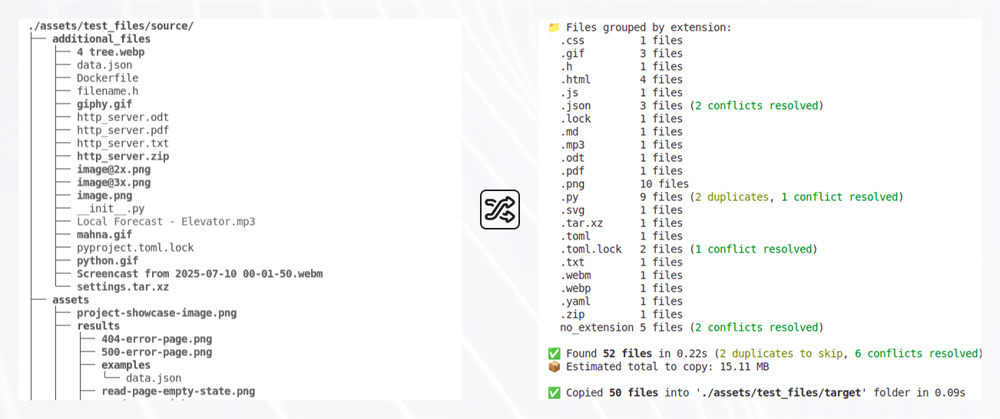
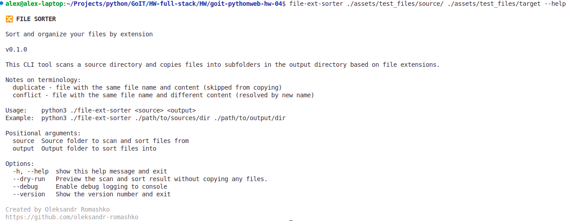
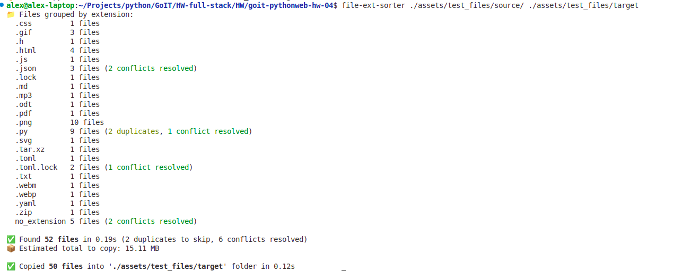
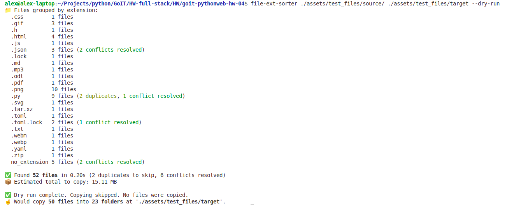

# Fullstack Web Development with Python <!-- omit in toc -->

### [# goit-pythonweb-hw-04](https://github.com/topics/goit-pythonweb-hw-04) <!-- omit in toc -->

<p align="center">
  
</p>


## 🔀 file-ext-sorter - _a Python CLI tool to sort files by extension_ <!-- omit in toc -->

Scans a source folder and organizes files into subfolders in an output directory based on their file extensions.

#### ✨ Main Features <!-- omit in toc -->

- 🔀 **Automatic file categorization** based on file extensions
- 🚀 **Asynchronous performance** using `asyncio`, `aiofiles`, and `aioshutil`
- 🎒 **Minimal and portable**: no databases, no external frameworks
- 🐍 **Compatible with Python 3.8–3.14+** (supports `asyncio.to_thread` polyfill)
- 📦 **PyPI**: install globally and use as a CLI command

<p align="center">
  
</p>


## Table of Contents <!-- omit in toc -->
- [📋 Requirements](#-requirements)
  - [Technical Requirements](#technical-requirements)
  - [Acceptance Criteria](#acceptance-criteria)
- [🧩 Task Solution](#-task-solution)
  - [✨ Features](#-features)
  - [💭 Thought on edge cases](#-thought-on-edge-cases)
    - [Handling Strategy \& Design Decisions](#handling-strategy--design-decisions)
    - [Duplicate Files vs Conflicts](#duplicate-files-vs-conflicts)
    - [File Extension Handling](#file-extension-handling)
    - [Files Without Extensions](#files-without-extensions)
  - [⚙️ Setup \& Running Locally](#️-setup--running-locally)
    - [Prerequisites](#prerequisites)
    - [Installation](#installation)
    - [Run the app locally (for the development)](#run-the-app-locally-for-the-development)
  - [🧰 Install Locally for Global Use](#-install-locally-for-global-use)
  - [📦 Use as an Installed Package](#-use-as-an-installed-package)
  - [📷 Solution Screenshots](#-solution-screenshots)
- [📅 Roadmap](#-roadmap)
- [🚀 Future Ideas](#-future-ideas)
- [🤝 How to Contribute](#-how-to-contribute)
- [📄 License](#-license)
- [🙏 Acknowledgements](#-acknowledgements)

## 📋 Requirements

The task was to implement a Python CLI tool that reads all files in a user-defined **source folder** and sorts them into subfolders in an **output folder**, based on file extensions. The sorting must be performed **asynchronously** to efficiently handle large file sets.

### Technical Requirements

1. Use appropriate **asynchronous libraries** (`asyncio`, `aiofiles`, etc.).
1. Create an `ArgumentParser` instance to handle CLI arguments.
1. Add required CLI arguments for defining source and output directories.
1. Initialize **asynchronous path objects** for source and destination.
1. Implement an async `read_folder()` function that recursively scans files in source (including subfolders).
1. Implement an async `copy_file()` function that copies files into target subfolders based on their extension.
1. Configure **logging** for error tracking.
1. Execute the asynchronous sorting logic inside the main runtime block.

### Acceptance Criteria

1. The script performs **asynchronous reading and copying** of files
1. Files are sorted into subfolders based on their **file extensions**
1. CLI arguments are **parsed and handled correctly**
1. **Errors are logged** properly
1. The code is **clean, readable**, and follows **PEP 8** standards


## 🧩 Task Solution

An asynchronous Python CLI tool that scans a user-defined source directory (including subfolders) and sorts files into subfolders inside a output directory based on file extensions.

Designed for efficient operation with large file sets using `asyncio`.

### ✨ Features

- Asynchronous recursive file scanning
- File sorting based on extension
- CLI interface with `argparse`
- Configurable source and destination folders
- Error handling with logging
- PEP 8-compliant codebase


### 💭 Thought on edge cases

Some file-handling situations don't have one "right" answer — only trade-offs. During development, a few decisions had to be made to keep the behavior consistent and predictable. This section explains how things like duplicates, extensions, and unnamed files are currently handled. These defaults aim to cover the most common use cases but may be improved or made configurable in future versions.

#### Handling Strategy & Design Decisions

Throughout development, several edge cases and ambiguous scenarios were encountered. In such cases, I made deliberate implementation choices based on practicality, expected behavior, and personal preference. These are considered reasonable defaults, though they may not suit every use case. Some of these behaviors may evolve in future versions or become configurable through CLI flags.

> 📌 These handling strategies are subject to change in future versions based on user feedback, edge cases, or CLI configurability.

#### Duplicate Files vs Conflicts

The app treats duplicates and name conflicts differently:

* Duplicates are detected when both the filename and file content (via SHA256 hash) match.
    * Only one copy is preserved — the one with the most recent modification time.
* Conflicts happen when filenames match but content does not.
    * These are resolved by renaming the incoming file with an index suffix (e.g., file(1).txt).

This behavior avoids redundant copies while retaining the most recent version of identical files.

#### File Extension Handling

Some files use compound extensions (e.g., `.tar.xz`, `.toml.lock`). To keep similar files grouped correctly:
* The entire compound extension is used (not just the last part).
* Group folders are named by replacing dots with underscores and removing leading dots:
    * `.tar.xz` → `tar_xz`
    * `.toml.lock` → `toml_lock`

This avoids mixing unrelated file types and makes folder names filesystem-safe.

#### Files Without Extensions

Files without extensions (e.g., `Dockerfile`, `LICENSE`) are grouped under:
* `no_extension`

Files starting with a dot (e.g., `.env`, `.gitignore`) are also considered extensionless and placed in the same group.

> ⚠️ Note: While .env or .gitignore might look like they have extensions, they're treated as extensionless for consistency.This behavior may become configurable later.

### ⚙️ Setup & Running Locally

This guide explains how to set up the environment and use the CLI tool locally.

#### Prerequisites

Before running the script, make sure the following are installed:

- **[Python 3.8+](https://www.python.org/downloads/)** — Required to run the script.
- (Recommended) **[Poetry](https://python-poetry.org/)** — To install dependencies and run in a virtual environment.
- (Optional) **[Git](https://git-scm.com/downloads)** — To clone [the repository](https://github.com/oleksandr-romashko/goit-pythonweb-hw-04), version control and development.
* (Optional) **[VS Code](https://code.visualstudio.com/download)** or another IDE — Recommended for browsing and editing the project source code and overall development. VS Code is recommended as the project has settings and debug launch scripts specifically for VS Code.

#### Installation

1. **Clone the Repository**

    ```bash
    git clone https://github.com/oleksandr-romashko/goit-pythonweb-hw-04.git
    cd goit-pythonweb-hw-04
    ```
2. **Install Dependencies**

    You can install dependencies using poetry or a virtual environment:
    
    ```bash
    poetry install
    ```

#### Run the app locally (for the development)

Command structure:

```bash
poetry run file-ext-sorter /path/to/source> /path/to/output
```

Example Usage:
```bash
poetry run file-ext-sorter ./assets/test_files/source/ ./assets/test_files/output/
```
This will:
1. Scan `./assets/test_files/source/` recursively.
2. Show source folder content summary.
3. Analyze duplicates and resolve conflicting files.
4. Copy all files to `./assets/test_files/output/`, organized into subfolders like:
    ```bash
    ./assets/test_files/output/
    ├── css
    │   └── style.css
    ├── json (2 conflicts resolved)
    │   ├── data.json
    │   ├── data(1).json
    │   └── data(2).json
    ├── py (2 duplicates, 1 conflict resolved)
    │   ├── __init__.py
    │   ├── __init__(1).py
    │   └── main.py
    ├── toml_lock (1 conflict resolved)
    │   ├── pyproject.toml.lock
    │   └── pyproject(1).toml.lock
    └── no_extension (2 conflicts resolved)
        ├── .gitignore
        ├── .gitignore(1)
        ├── Dockerfile
        └── LICENSE
    ```
Help menu:
```bash
poetry run file-ext-sorter --help
```

### 🧰 Install Locally for Global Use

If you'd like to test the app globally on your system without publishing to PyPI:

1. **Build the wheel using Poetry**:
    ```bash
    poetry build
    ```
2. Install the built package locally using pip:
    ```bash
    pip install dist/file_ext_sorter-0.1.0-py3-none-any.whl
    ```
    > ⚠️ Note: Exact file name may vary, but should be something like `file_ext_sorter-*.whl`.
3. Run it globally from anywhere:
    ```bash
    file-ext-sorter ./assets/test_files/source/ ./assets/test_files/target
    ```
4. Uninstall when you're done:
    ```bash
    pip uninstall file-ext-sorter
    ```

### 📦 Use as an Installed Package

This project is [published on PyPI]().

For usage instructions, see the [PyPI README](./README.pypi.md) or visit the [project page on PyPI]().

### 📷 Solution Screenshots

Help menu:



Normal run using test files:



Dry-run (preview the scan and sort result without copying) using test files:



## 📅 Roadmap

This project does not follow a strict roadmap — features are added as needed or requested.

If you have suggestions or need specific functionality, feel free to [open an issue](https://github.com/oleksandr-romashko/goit-pythonweb-hw-04/issues), [submit a feature request](https://github.com/oleksandr-romashko/goit-pythonweb-hw-04/issues/new?template=feature_request.md), or contribute directly.

## 🚀 Future Ideas

* 🟡 **Medium Priority**
    * **Add automated testing**
        Introduce unit tests, especially for core logic. This may require refactoring some large functions into smaller, testable units.
* 🟢 **Nice to Have**
    * **Add `--exclude` CLI option**
        Allow users to specify file types or patterns (e.g., .log, .tmp, or regex) to exclude from sorting.
    * **Support include/exclude (whitelist/blacklist) lists**
        Add `--include` and `--exclude` options to define exact file types to sort, offering better control.
    * **More verbose console output**
        Display sorted files grouped by extension with details:
        ```bash
        .json    3 files (2 conflicts resolved)
            data.json
            data(1).json
            data(2).json
        ```
    * **Set default paths**
        Allow default values for source and/or output arguments to improve UX and quick testing.
    * **Adjustable concurrency***
        Add `--concurrency` option to control number of async workers. Support intelligent auto-scaling based on file count, size, or system load.
    * **Duplicate handling strategies**
        Add configurable naming strategies for file name conflicts:
        * `--rename-with-index (default)`
        * `--rename-with-parent-folder`
        * `--skip-conflicts`
        * `--move-duplicates-to /duplicates`
    * **Safe overwrite options**
        Let users decide how to handle existing files:
        * Overwrite
        * Skip
        * Cancel operation
        * Rollback changes on cancellation
    * **Show log from CLI**
        Add `--show-logfile` flag to print the application log to the console (e.g., last X lines).
        (Note: currently `--debug` flag allows to show detailed logs)
    * **Toggle verbosity/debug dynamically**
        Add `--verbose` CLI flag to enable debug-level logging without modifying code.
        Set `--log-level` to show certain logging levels.
* ⬤ **Skipped (for now, but worth reconsidering)**
    * **Progress bar while copying**
        Show basic visual feedback during file operations (█▒▒▒ 10%). Helps users see ongoing progress.
    * **tqdm-style async progress bar**
        Integrate `tqdm.asyncio` for richer, real-time feedback with multi-extension support.

## 🤝 How to Contribute

Pull requests are welcome! For major changes, please open an issue first to discuss what you'd like to change.

## 📄 License

This project is licensed under the [MIT License](./LICENSE).
You are free to use, modify, and distribute this software in accordance with the terms of the license.

## 🙏 Acknowledgements

Special thanks to the following open-source libraries:

* [aiopath](https://pypi.org/project/aiopath/)
* [aioshutil](https://pypi.org/project/aioshutil/)
* [colorama](https://pypi.org/project/colorama/)
