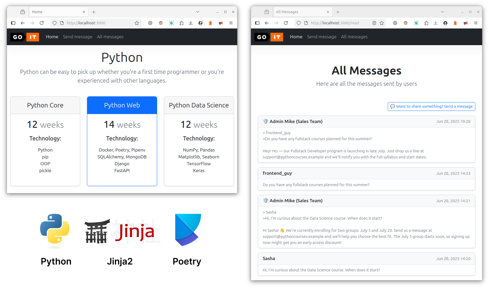
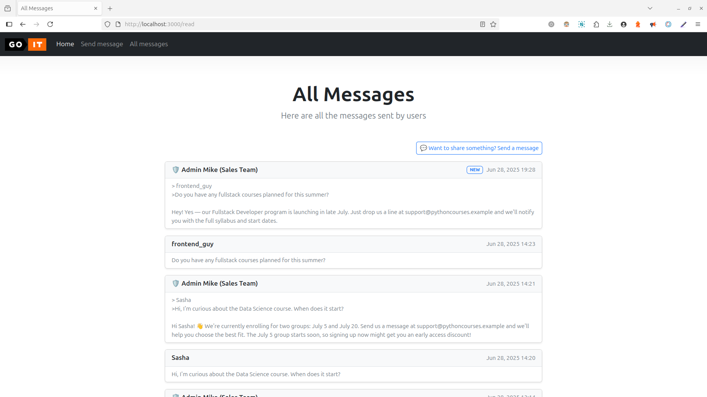
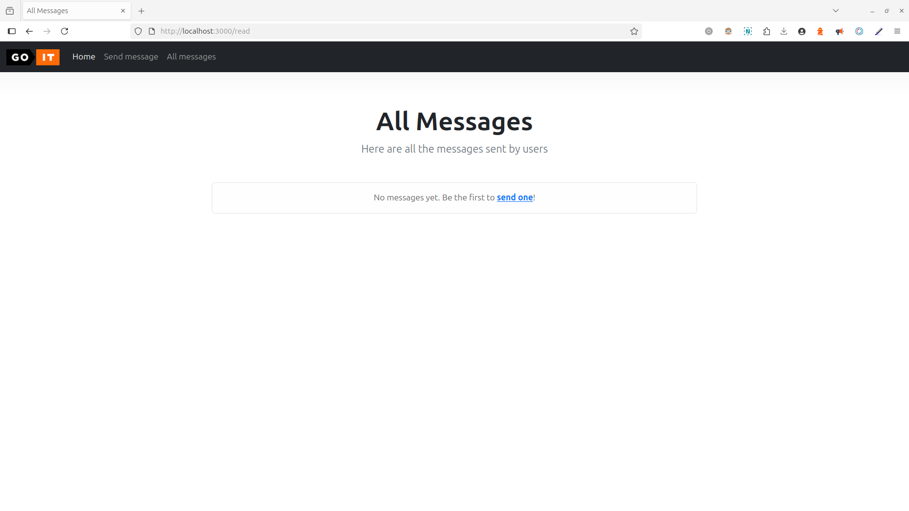
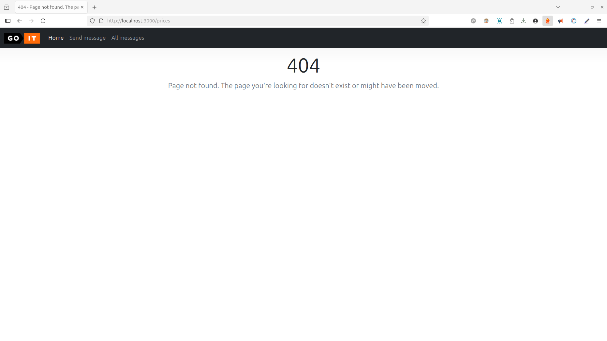
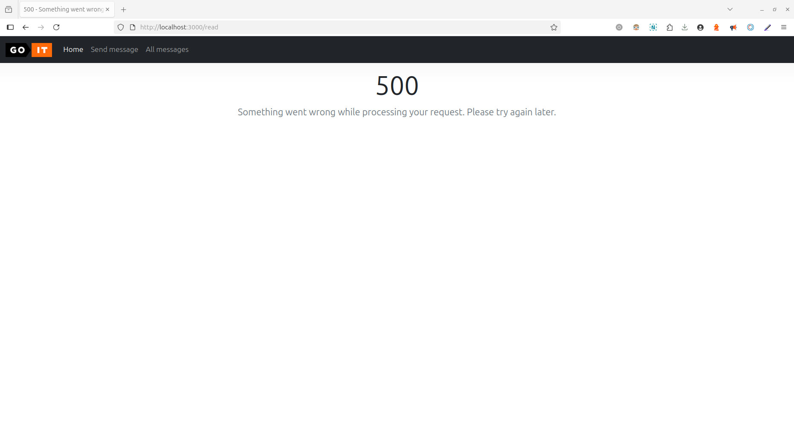
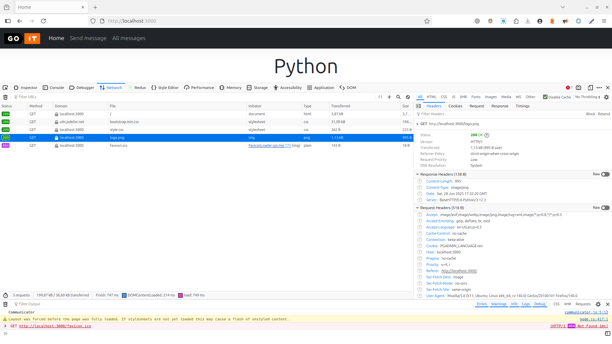

# Fullstack Web Development with Python <!-- omit in toc -->

### [# goit-pythonweb-hw-03](https://github.com/topics/goit-pythonweb-hw-03) <!-- omit in toc -->

<p align="center">
  
</p>


## The Basics of the Web. Simple HTTP Server Build. <!-- omit in toc -->

This project showcases a minimalist HTTP server implemented in pure Python, using the standard [http.server](https://docs.python.org/3/library/http.server.html) module. The server serves static pages and assets, renders dynamic templates via [Jinja2](https://jinja.palletsprojects.com/), and handles form submissions with data persistence.

<p align="center">
  
</p>

It supports `GET` and `POST` requests and features:

* Basic routing and clean URL handling (`/message` instead of `/message.html`)
* Static file serving with MIME type detection (images, css, js, etc.) and path traversal protection
* Dynamic page rendering with message data (using templates and Jinja2)
* Message storage using a local JSON file
* Simple error and redirect handling
* Logging for server activity
* Docker- and Compose-ready

All functionality runs in a single, self-contained Python environment — without any external web frameworks or databases.

> ⚠️ **Important note**  
> This setup is intended for local development and educational purposes only.  
> It is **not production-ready** and lacks critical features such as input sanitization, HTTPS, concurrency, and robust error handling.  
> While some basic safeguards are included, **significant hardening would be required** for real-world deployment.

## Table of Contents <!-- omit in toc -->
- [Task Requirements](#task-requirements)
  - [Technical Description](#technical-description)
    - [Form Processing and Data Storage](#form-processing-and-data-storage)
    - [Additional Route: /read](#additional-route-read)
  - [Optional Enhancements (Not Required)](#optional-enhancements-not-required)
  - [Acceptance Criteria](#acceptance-criteria)
    - [Main Acceptance Criteria](#main-acceptance-criteria)
    - [Additional (Optional) Requirements](#additional-optional-requirements)
- [Task Solution](#task-solution)
  - [Features](#features)
  - [Project Files Structure](#project-files-structure)
  - [Docker Hub](#docker-hub)
  - [Solution Screenshots](#solution-screenshots)
- [Project Setup \& Run Instructions](#project-setup--run-instructions)
  - [Prerequisites](#prerequisites)
  - [Setting Up the Development Environment](#setting-up-the-development-environment)
    - [1. Clone the Repository](#1-clone-the-repository)
    - [2. Choose Setup Method](#2-choose-setup-method)
      - [🐳 Option 1: Using Docker Compose (_Recommended, easiest way to run the app with minimal setup_)](#-option-1-using-docker-compose-recommended-easiest-way-to-run-the-app-with-minimal-setup)
      - [🐳 Option 2: Run with Docker (_Alternative Method_)](#-option-2-run-with-docker-alternative-method)
      - [🐍 Option 3: Local Development (Poetry)](#-option-3-local-development-poetry)
- [License](#license)

## Task Requirements

Your goal is to implement a basic web application. As a starting point, use the following repository:
[https://github.com/GoIT-Python-Web/FullStack-Web-Development-hw3](https://github.com/GoIT-Python-Web/FullStack-Web-Development-hw3).

The application should use Python's built-in HTTP server and follow the structure demonstrated in the course materials. It must serve multiple HTML pages, handle static assets, process a form submission, and store messages persistently in a JSON file.

This task is intended to reinforce your understanding of basic routing, HTTP handling, and file-based persistence.

### Technical Description

You are required to build a simple web application with routing for two HTML pages:

* `index.html`
* `message.html`

Additionally, your app must:

* Serve static resources: `style.css`, `logo.png`
* Process a form on the `message.html` page
* Return a custom error page (`error.html`) in case of a `404 Not Found` error
* Listen on port `3000`

#### Form Processing and Data Storage

When the form on `message.html` is submitted, the application must:

1. Convert the received byte-string into a Python dictionary
2. Save the resulting data into a JSON file `data.json` located inside `storage` directory

The JSON format should follow this structure:

```json
{
  "2022-10-29 20:20:58.020261": {
    "username": "krabaton",
    "message": "First message"
  },
  "2022-10-29 20:21:11.812177": {
    "username": "Krabat",
    "message": "Second message"
  }
}
```

Each key is the timestamp of the message, generated using `datetime.now()`.

#### Additional Route: /read

Create a new route `/read`, which renders a Jinja2 template that displays all stored messages from `data.json`.

### Optional Enhancements (Not Required)

* Create a `Dockerfile` to run the application in a Docker container
* Use Docker `volumes` to store the `storage/data.json` file outside the container

### Acceptance Criteria

#### Main Acceptance Criteria

1. **Routing and Pages**
   * The application includes two HTML pages: `index.html` and `message.html`
   * Static files (`style.css`, `logo.png`) are served correctly
   * The server runs on port `3000`
2. **Form Handling**
    * The form on `message.html` page collects username and message.
    * Submitted form data is converted into a dictionary. The data is stored in `storage/data.json` using timestamp keys.
    ```json
    {
      "%timestamp%": {
        "username": "example",
        "message": "example message"
      }
    }
    ```
3. **Message Display**
    * A `GET` request to `/read` returns a Jinja2-based page
    * The page renders all saved messages from the JSON file `data.json`
4. **Error Handling**
    A `404 Not Found` triggers to serve `error.html` page
5. **Data Storage**
    * Messages are saved in `storage/data.json` as valid JSON
    * Each key represents the exact time the message was received

#### Additional (Optional) Requirements

* A `Dockerfile` is created that allows running the app as a Docker container
* A volume is used to persist `data.json` outside the container

## Task Solution

A lightweight Python HTTP server built with `http.server` and `Jinja2`, featuring static file serving, dynamic templates, and form submission with local JSON-based persistence.

### Features

- Routes: `/`, `/message`, `/read`
- Static assets (images, HTML, JS, CSS)
- Form submission with data saved to JSON file
- Custom error page based on Jinja2 template
- Docker support
- Compose support

### Project Files Structure
```
.
├── compose.yaml                # Docker Compose file
├── Dockerfile                  # Docker image definition
├── .dockerignore               # Files/folders to exclude from Docker context
├── pyproject.toml              # Project dependencies and config (Poetry)
└── src/
    ├── main.py                 # Entry point for the application
    ├── decorators/
    │   └── handle_server_errors.py   # Decorator to catch and handle server errors
    ├── storage/
    │   ├── data/
    │   │   └── data.json       # App's message data (created on first write)
    │   └── storage.py          # Functions to read/write saved in storage data
    ├── utils/
    │   ├── constants.py        # Constants used across the app
    │   └── validations.py      # Input validation helpers
    └── web/
        ├── static/
        │   ├── images/         # Logos, icons, etc.
        │   ├── pages/          # Pure static HTML pages
        │   ├── scripts/        # JavaScript files
        │   └── styles/         # CSS or SCSS stylesheets
        └── templates/
            ├── error.html      # Template for error pages
            └── read.html       # Template to display submitted messages
```

### Docker Hub

This project is also published to [Docker Hub](https://hub.docker.com/r/rmsh/goit-pythonweb-hw-03).

You can pull and run it directly:

```bash
docker pull rmsh/goit-pythonweb-hw-03
```

### Solution Screenshots

Messages shown on the rendered `/read` page:



Empty messages state at rendered `/read` page:



Rendered 404 Not Found error page:



Rendered 500 Internal Server error page:



Served static resources:



## Project Setup & Run Instructions

This guide will help you set up the environment and run the project.

### Prerequisites

Before you begin, make sure you have the following installed:

* **[Python 3.10.*](https://www.python.org/downloads/release/python-31018/)** (tested with 3.10.18) — Required to run the application locally (outside Docker, if needed).
* (Optional - for local development) **[Poetry](https://python-poetry.org/)** - To manage dependencies in virtual environment.
* **[Docker](https://www.docker.com/)** — Used to containerize the application in a unified environment using Docker or Docker Compose.
* (Optional - for local development) **[Git](https://git-scm.com/downloads)** — To clone [the repository](https://github.com/oleksandr-romashko/goit-pythonweb-hw-03), version control and development.
* (Optional - for local development) **[VS Code](https://code.visualstudio.com/download)** or another IDE — Recommended for browsing and editing the project source code and overall development.

### Setting Up the Development Environment

#### 1. Clone the Repository

```bash
git clone https://github.com/oleksandr-romashko/goit-pythonweb-hw-03
cd goit-pythonweb-hw-03-main
```

or download the ZIP archive from [GitHub Repository](https://github.com/oleksandr-romashko/goit-pythonweb-hw-03) and extract it.

#### 2. Choose Setup Method

You can either run the project in a fully containerized development environment (**_recommended_**) or set it up locally using a virtual environment.

##### 🐳 Option 1: Using Docker Compose (_Recommended, easiest way to run the app with minimal setup_)

> This method runs app using Docker Compose

```bash
docker compose up --build
```

This will:

1. Build the FastAPI application image.
2. Create and run the container with necessary ports.
3. Use a volume for data persistence.

The app will be available at: http://localhost:3000

To stop:

```bash
docker compose down
```

##### 🐳 Option 2: Run with Docker (_Alternative Method_)

> For those who want a bit more control using `docker run`.

1. Build the Docker image:
    ```bash
    docker build -t goit-pythonweb-hw-03 .
    ```
2. (Optional) Create a named volume for persistent data:
    > Only needed once before first run:
    ```bash
    docker volume create storage_data
    ```
3. Run the Docker container:
    ```bash
    docker run -p 3000:3000 \
    -v storage_data:/app/storage/data \
    --rm -ti \
    --name goit-pythonweb-hw-03 \
    goit-pythonweb-hw-03
    ```

    App will be available at: http://localhost:3000

##### 🐍 Option 3: Local Development (Poetry)

> For local development without Docker.

1. Install dependencies:
    ```bash
    poetry install
    ```
2. Run the app:
    ```bash
    poetry run python src/main.py
    ```

    App will be available at: http://localhost:3000


## License

This project is licensed under the [MIT License](./LICENSE).
You are free to use, modify, and distribute this software in accordance with the terms of the license.